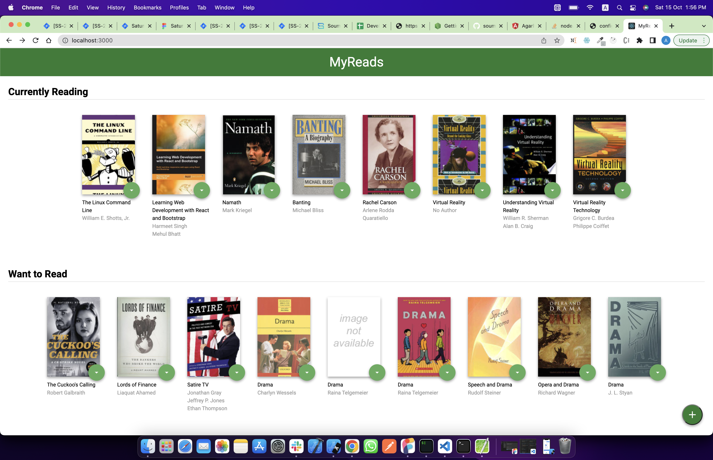
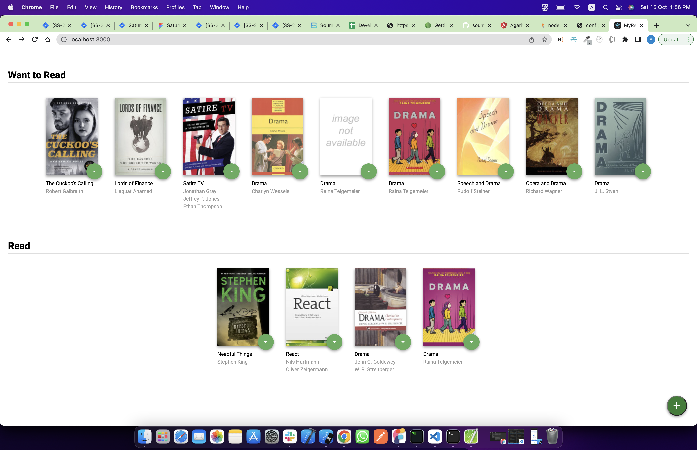
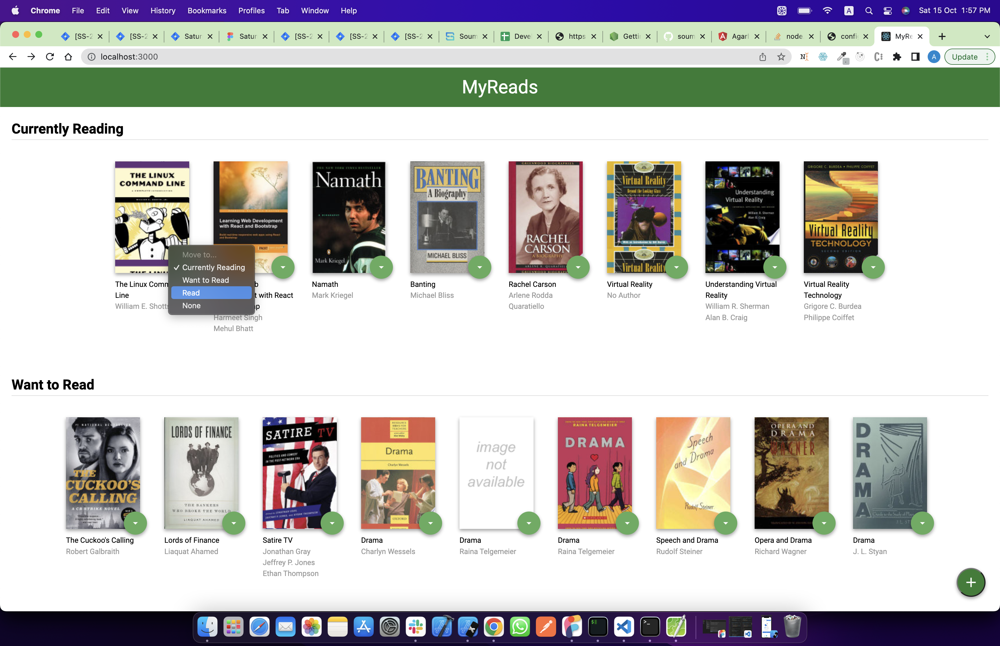
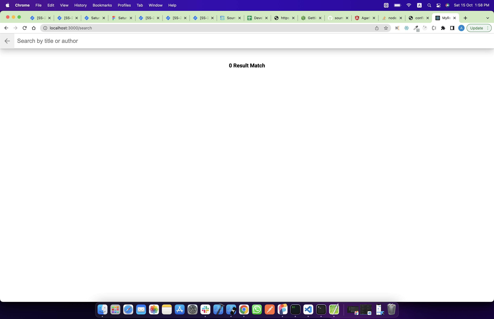
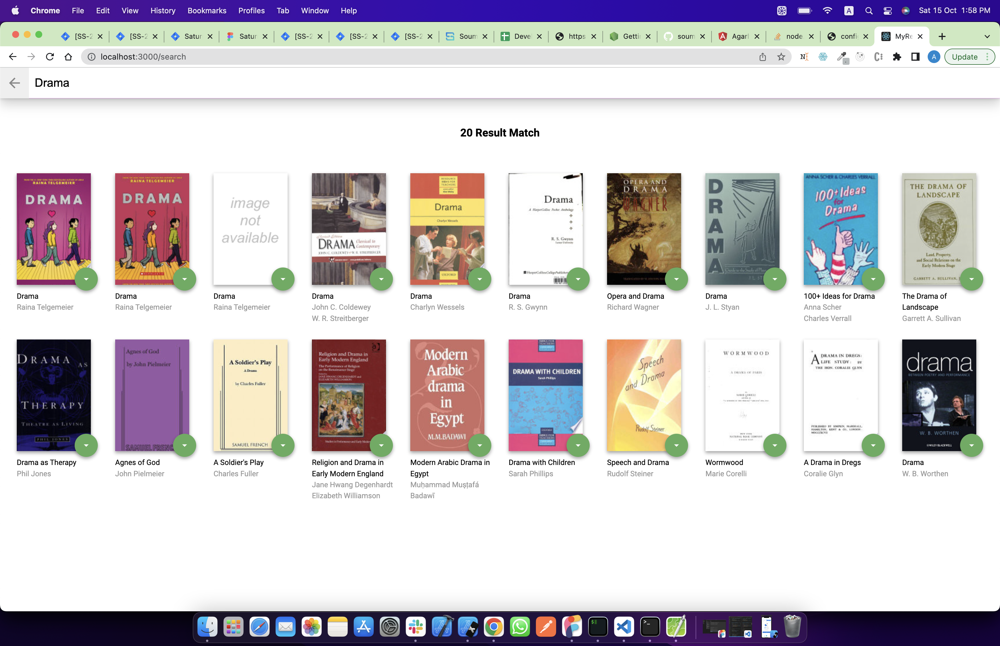
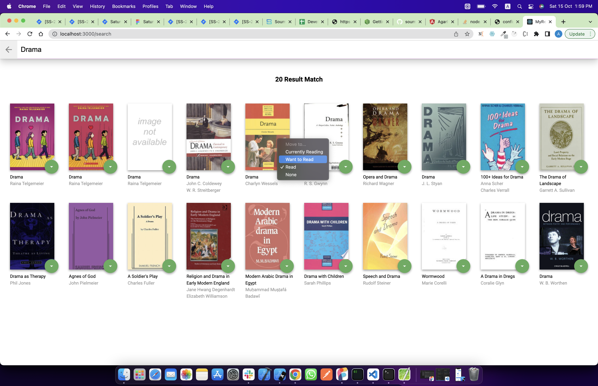

# MyReads Project

This app is the first of three projects required for Udacity's React Nanodegree program
It also allow you to search for books based on title and author.

MyReads is a simple cataloging app that allows you to place books in one of three shelves or categories.

1 - Currently Reading
2 - Want to Read
3 - Read

## Installation

- install project with `npm install`
- run with `npm start`

## Screenshots

       
       
       
       
       
       

